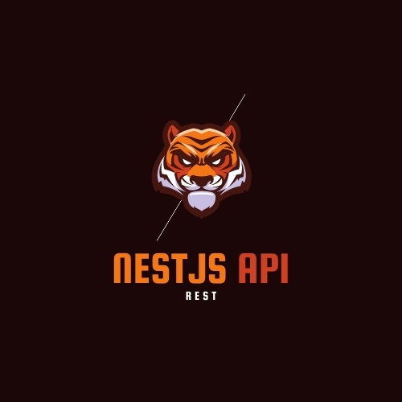

[](https://github.com/danilo-righetto/nestjs-api/)

# NestJS - API

[](https://github.com/danilo-righetto/nestjs-api/blob/master/LICENSE.md)

> :rocket: Creating a REST API with NestJS.

## About the project 

Working with [NestJS](https://nestjs.com/) for APIs.

## Run the project locally

Use this command to start the project with NestJS:
```sh
$ npm run start
```

## Versioning

To keep better organization of releases we follow the [Semantic Versioning 2.0.0](http://semver.org/) guidelines.

## Contributing

To contribute to the project see: [CONTRIBUTING.md](https://github.com/danilo-righetto/nestjs-api/blob/master/CONTRIBUTING.md)

## License
[MIT License](https://github.com/danilo-righetto/nestjs-api/blob/master/LICENSE.md) © [Danilo Righetto](https://www.danilorighetto.com.br/)